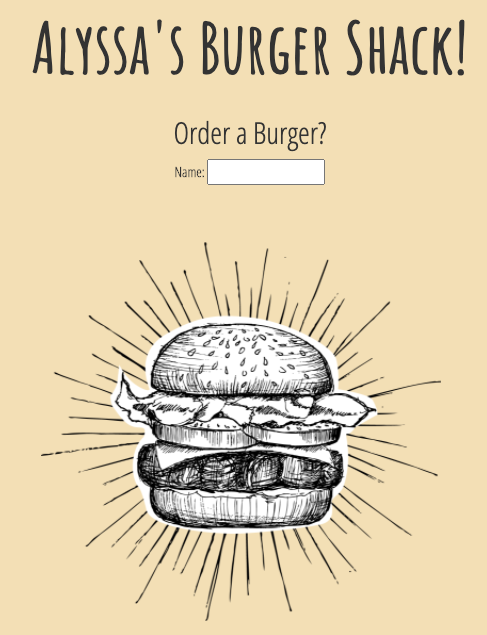

# **Alyssa's Burger Shack**
### https://evening-retreat-75678.herokuapp.com/

## **Description:**
This application demonstrates a simple full stack application with a front end implemented with HTML/CSS and the backend implemented with Node.js and Express. HTML templating is done with the help of Handlebars. 

## **Table of Contents**

### - [Installation](#Installation)

### - [Usage](#Usage)

### - [License](#License)

### - [Contribute](#Contribute)

### - [Tests](#Tests)

### **Installation**
This application will need to run the following commands run to install dependencies: if downloading repository the user will need to run NPM i before running program, however if using deployed heorku version, no installs are necessary

### **Usage**
The user may enter any burger name to add it to the menu. This also adds the new burger entry into the MySQL database. The initial burger entry is added as available on the menu and placed on the left side of the screen. The user may then eat any burger by clicking on it, which moves it into the adjacent column and updates its status accordingly in the database. Enjoy and have a burger!

### **License**
This application will require the following Licenses: undefined

### **Contribute**
If you would like to contribute to this application please note the following: If submitting your own edits, please make your own branch and 

**If you have any questions about this project please contact acschmalenberger via email at: aschmalenberger@gmail.com.**

